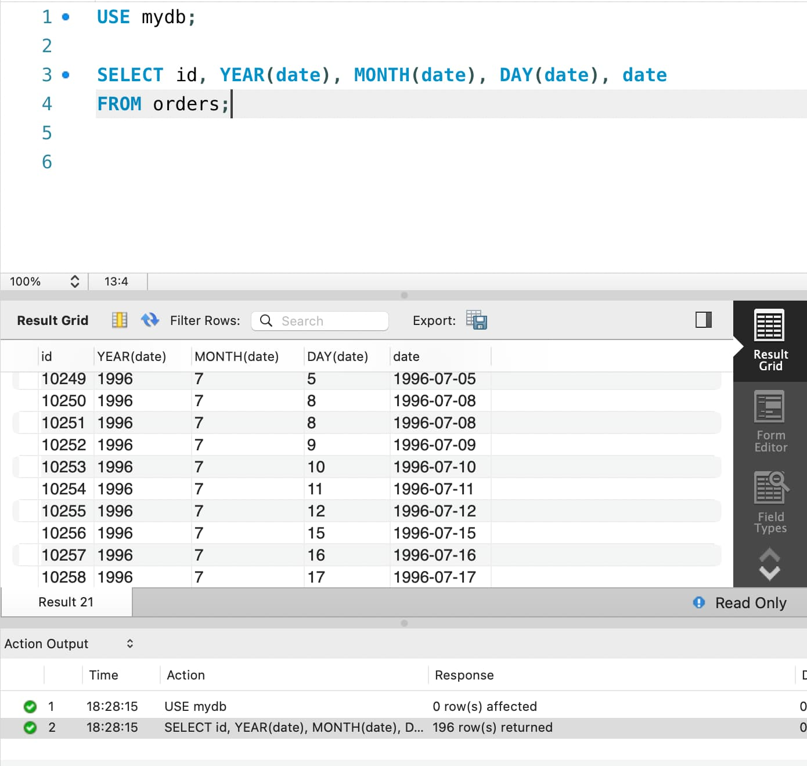
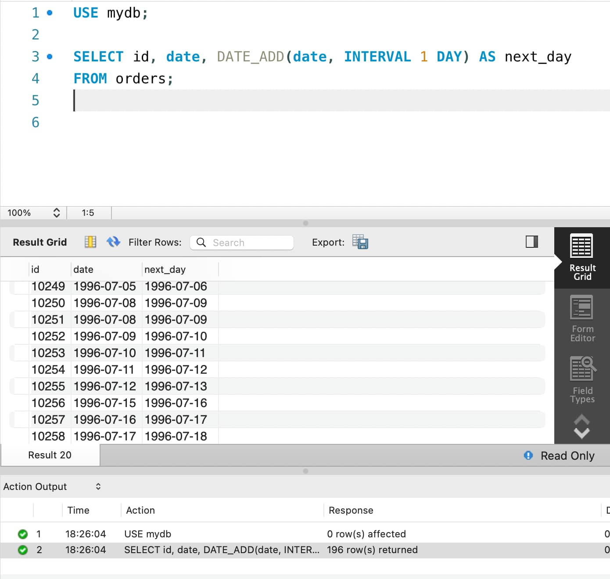
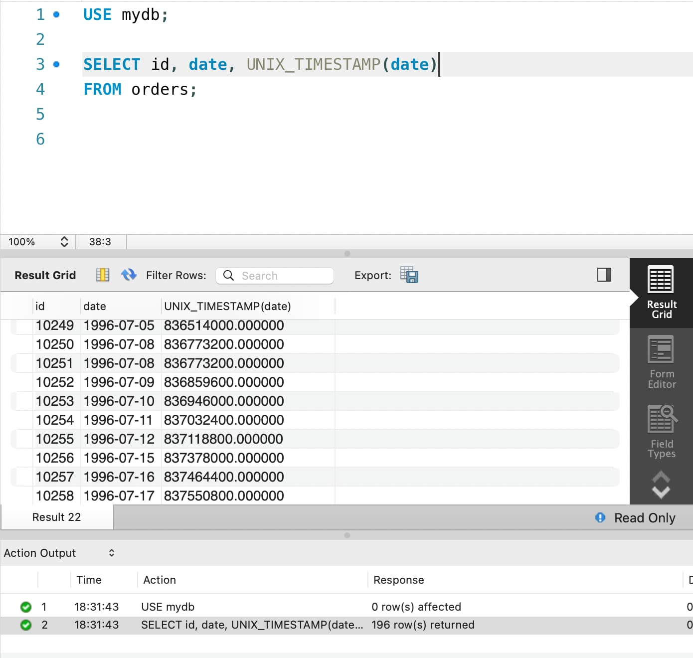
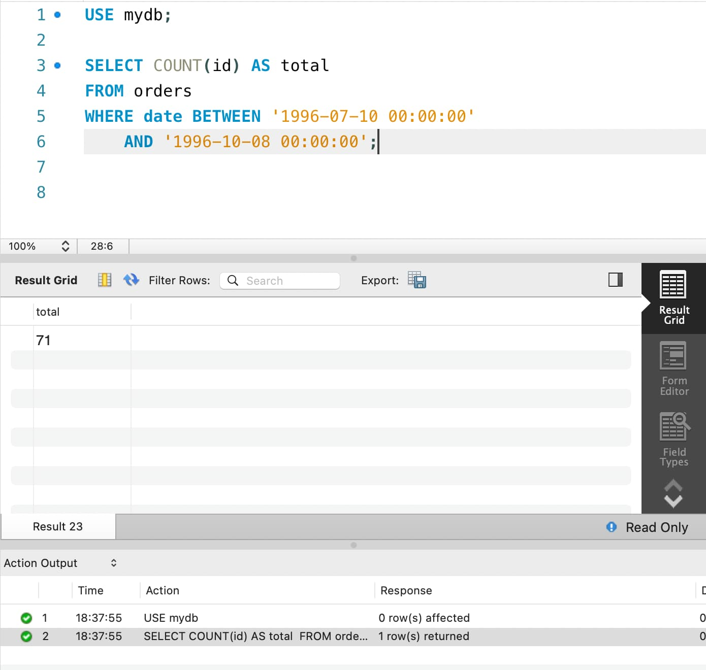
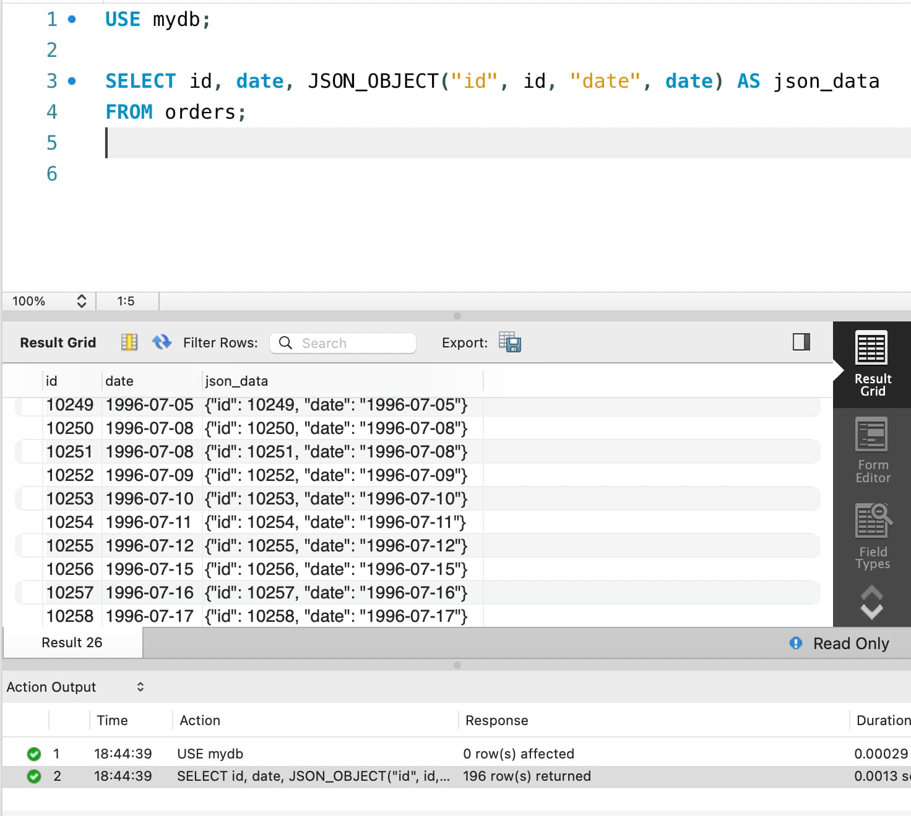

# goit-rdb-hw-07

**#1**

```
SELECT id, YEAR(date), MONTH(date), DAY(date), date 
FROM orders;
```

<details>
  <summary>Screenshot</summary>



</details>

**#2**

```
SELECT id, date, DATE_ADD(date, INTERVAL 1 DAY) AS next_day
FROM orders;
```

<details>
  <summary>Screenshot</summary>



</details>

**#3**

```
SELECT id, date, UNIX_TIMESTAMP(date)
FROM orders;
```

<details>
  <summary>Screenshot</summary>



</details>

**#4**

```
SELECT COUNT(id) AS total 
FROM orders
WHERE date BETWEEN '1996-07-10 00:00:00' 
	AND '1996-10-08 00:00:00';
```

<details>
  <summary>Screenshot</summary>



</details>

**#5**

```
SELECT id, date, JSON_OBJECT("id", id, "date", date) AS json_data 
FROM orders;
```

<details>
  <summary>Screenshot</summary>



</details>
